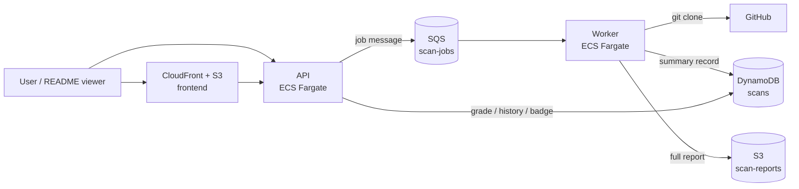

# Architecture

Target AWS architecture (Milestone 3+). Locally, LocalStack stands in for SQS, DynamoDB, and S3.

```mermaid
flowchart LR
  user[User / README viewer] --> cf[CloudFront + S3<br/>frontend]
  user --> api[API<br/>ECS Fargate]
  cf --> api
  api -->|job message| sqs[(SQS<br/>scan-jobs)]
  sqs --> worker[Worker<br/>ECS Fargate]
  worker -->|git clone| gh[GitHub]
  worker -->|summary record| ddb[(DynamoDB<br/>scans)]
  worker -->|full report| s3[(S3<br/>scan-reports)]
  api -->|grade / history / badge| ddb
```
